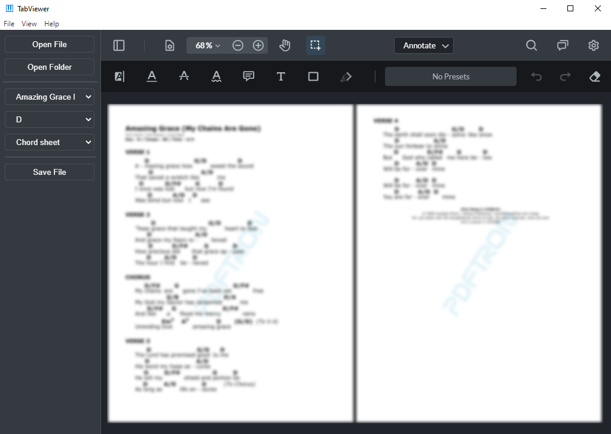

# TabViewer


[](https://github.com/wrrnlim/TabViewer/releases)


<sub><sup>*Song sheet partly removed due to copyright*</sup></sub>

Easily view and annotate your music tabs all in one place. TabViewer enables you to view music sheets and switch between songs, music keys, and lead sheet/chord sheet formats within a folder. Annotate your music with handwriting, text, or highlights, and export it as a PDF.

## Installation

To install, go to the [releases](https://github.com/wrrnlim/TabViewer/releases/) page and download the setup `.zip` for the latest release. Unzip the file and run the installer to install! Each release has a VirusTotal check and a checksum to verify that the download does not contain any viruses.

## Usage

Currently, songs files must have the following naming convention:

```text
song-name-A-cs.pdf
```

where `A` is the key that the song is in, and `cs` is `cs` or `ls` for chord sheet and lead sheet respectively. Place all your song sheets into a folder, then open the folder in TabViewer. If you have a song in multiple keys and correctly followed the naming convention, you can change the key using the dropdown menus. The same applies for songs with both chord sheet and lead sheet files.

In future updates, I plan to add an upload section to the app, so users can upload files and have files automatically renamed.

## Roadmap

Planned features are opened as Issues with the [enhancements](https://github.com/wrrnlim/TabViewer/issues?q=is%3Aissue+is%3Aopen+label%3Aenhancement) label. You may also view the [project board](https://github.com/users/wrrnlim/projects/3/views/1). Feel free to contribute to this project by putting in a pull request!

## Resources

The PDF webviewer used in this project is created by [PDFTron](https://github.com/PDFTron/webviewer-electron-sample/) ([tutorial](https://youtu.be/FyZ40lNE-pY))
