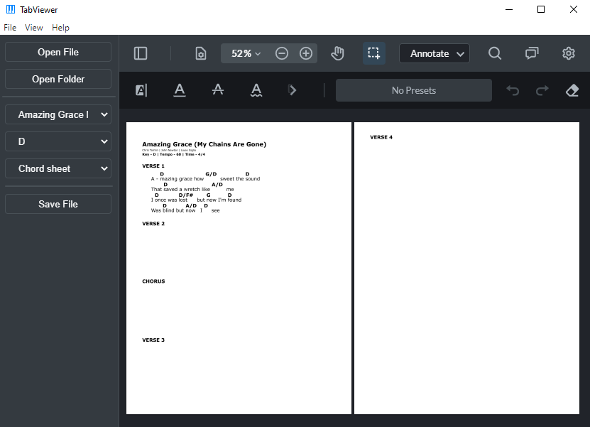

# TabViewer


[](https://github.com/wrrnlim/TabViewer/releases)

*Song sheet blurred for copyright reasons*

Easily view and annotate your music tabs all in one place. TabViewer enables you to view music sheets and switch between songs, music keys, and lead sheet/chord sheet formats within a folder. Annotate your music with handwriting, text, or highlights, and export it as a PDF.

## Usage
Currently, songs files must have the following naming convention:

```text
song-name-A-cs.pdf
```
where A is the key that the song is in, and cs is cs or ls, for chord sheet and lead sheet respectively.

## Credits

The PDF webviewer used in this project is created by [PDFTron](https://github.com/PDFTron/webviewer-electron-sample/) ([tutorial](https://youtu.be/FyZ40lNE-pY))
